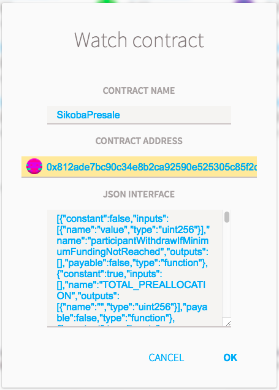
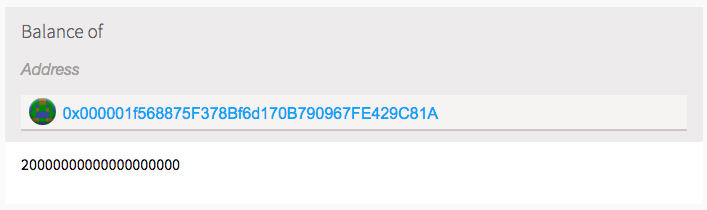
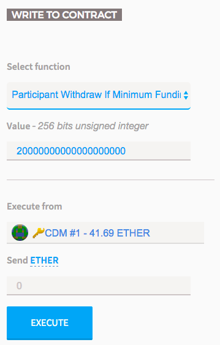
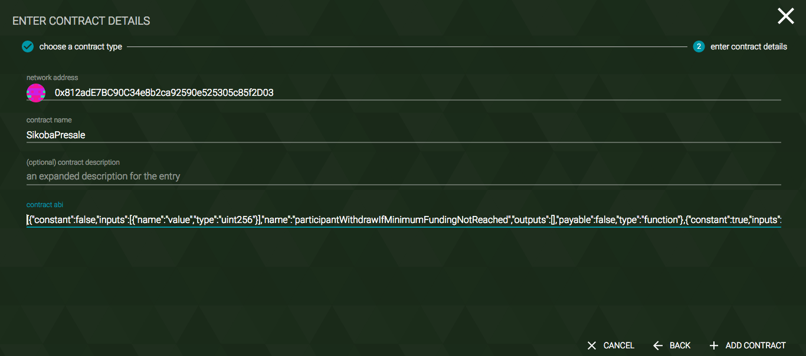
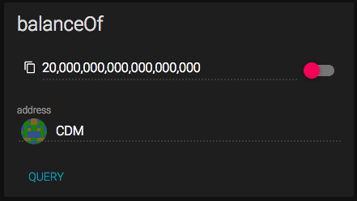
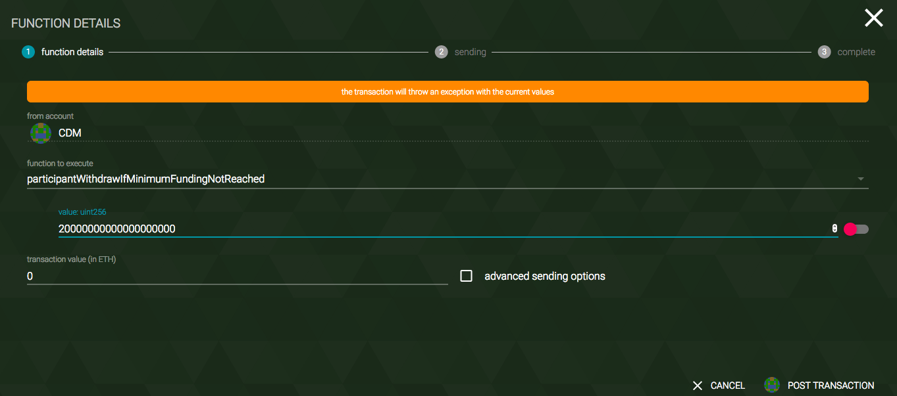
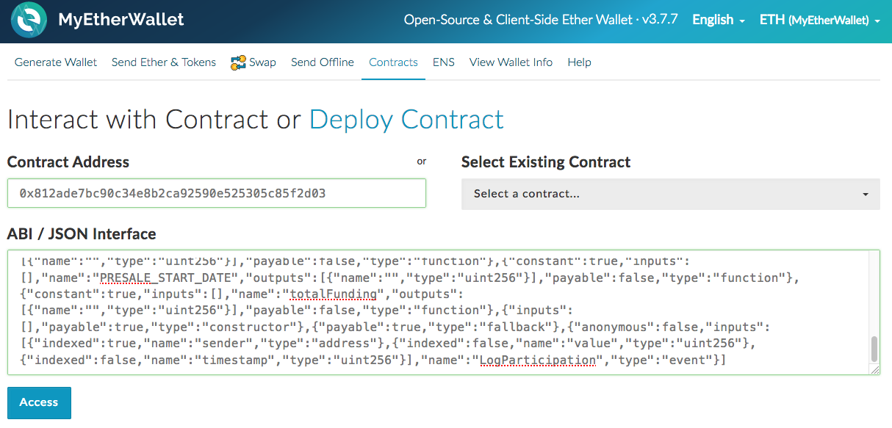
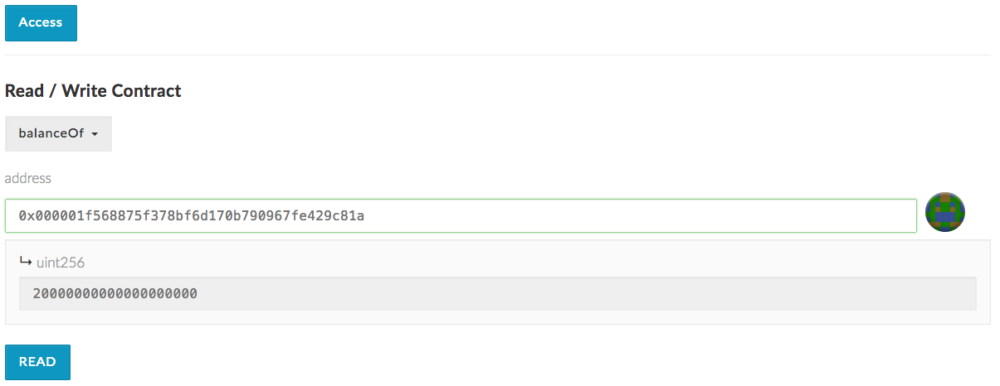
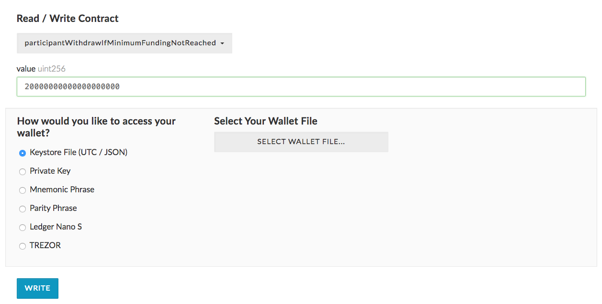

# How To Withdraw Your Presale Contribution From The SikobaPresale Contract

The SikobaPresale contract has been deployed to [0x812ade7bc90c34e8b2ca92590e525305c85f2d03](https://etherscan.io/address/0x812ade7bc90c34e8b2ca92590e525305c85f2d03). As the crowdfunding has not raised funds over the minimum, participants will need to withdraw their contributions from this contract.

**Table of contents**

* [To Withdraw Your Refunds Using Ethereum Wallet / Mist](#to-withdraw-your-refunds-using-ethereum-wallet--mist)
  * [Watch The SikobaPresale Contract](#watch-the-sikobapresale-contract)
  * [Retrieve Your Contribution Balance](#retrieve-your-contribution-balance)
  * [Execute Your Refund Withdrawal](#execute-your-refund-withdrawal)
* [To Withdraw Your Refunds Using Parity](#to-withdraw-your-refunds-using-parity)
  * [Watch The SikobaPresale Contract](#watch-the-sikobapresale-contract)
  * [Retrieve Your Contribution Balance](#retrieve-your-contribution-balance)
  * [Execute Your Refund Withdrawal](#execute-your-refund-withdrawal)
* [To Withdraw Your Refunds Using MyEtherWallet](#to-withdraw-your-refunds-using-myetherwallet)
  * [Watch The SikobaPresale Contract](#watch-the-sikobapresale-contract)
  * [Retrieve Your Contribution Balance](#retrieve-your-contribution-balance)
  * [Execute Your Refund Withdrawal](#execute-your-refund-withdrawal)

 

## To Withdraw Your Refunds Using Ethereum Wallet / Mist

### Watch The SikobaPresale Contract

In Ethereum Wallet / Mist, select the **CONTRACTS** tab and click **WATCH CONTRACT** to open the **Watch contract** window. Then:
* Under **CONTRACT NAME**, enter `SikobaPresale`
* Under **CONTRACT ADDRESS**, enter `0x812ade7bc90c34e8b2ca92590e525305c85f2d03`
* Copy the Application Binary Interface below and paste it into the **JSON INTERFACE** text box

  > [{"constant":false,"inputs":[{"name":"value","type":"uint256"}],"name":"participantWithdrawIfMinimumFundingNotReached","outputs":[],"payable":false,"type":"function"},{"constant":true,"inputs":[],"name":"TOTAL_PREALLOCATION","outputs":[{"name":"","type":"uint256"}],"payable":false,"type":"function"},{"constant":true,"inputs":[],"name":"MINIMUM_PARTICIPATION_AMOUNT","outputs":[{"name":"","type":"uint256"}],"payable":false,"type":"function"},{"constant":false,"inputs":[{"name":"value","type":"uint256"}],"name":"ownerWithdraw","outputs":[],"payable":false,"type":"function"},{"constant":true,"inputs":[],"name":"PRESALE_MINIMUM_FUNDING","outputs":[{"name":"","type":"uint256"}],"payable":false,"type":"function"},{"constant":true,"inputs":[],"name":"OWNER_CLAWBACK_DATE","outputs":[{"name":"","type":"uint256"}],"payable":false,"type":"function"},{"constant":true,"inputs":[],"name":"PRESALE_MAXIMUM_FUNDING","outputs":[{"name":"","type":"uint256"}],"payable":false,"type":"function"},{"constant":true,"inputs":[],"name":"MAXIMUM_PARTICIPATION_AMOUNT","outputs":[{"name":"","type":"uint256"}],"payable":false,"type":"function"},{"constant":true,"inputs":[{"name":"","type":"address"}],"name":"balanceOf","outputs":[{"name":"","type":"uint256"}],"payable":false,"type":"function"},{"constant":true,"inputs":[],"name":"owner","outputs":[{"name":"","type":"address"}],"payable":false,"type":"function"},{"constant":false,"inputs":[],"name":"ownerClawback","outputs":[],"payable":false,"type":"function"},{"constant":true,"inputs":[],"name":"PRESALE_END_DATE","outputs":[{"name":"","type":"uint256"}],"payable":false,"type":"function"},{"constant":true,"inputs":[],"name":"PRESALE_START_DATE","outputs":[{"name":"","type":"uint256"}],"payable":false,"type":"function"},{"constant":true,"inputs":[],"name":"totalFunding","outputs":[{"name":"","type":"uint256"}],"payable":false,"type":"function"},{"inputs":[],"payable":true,"type":"constructor"},{"payable":true,"type":"fallback"},{"anonymous":false,"inputs":[{"indexed":true,"name":"sender","type":"address"},{"indexed":false,"name":"value","type":"uint256"},{"indexed":false,"name":"timestamp","type":"uint256"}],"name":"LogParticipation","type":"event"}]

* Click **OK**

  

### Retrieve Your Contribution Balance

* Select the newly watched SikobaPresale contract
* Under the **READ FROM CONTRACT** column on the left hand side, enter the account you contributed from in the **Balance of** field
* Copy the balance displayed

  

### Execute Your Refund Withdrawal

* Under the **WRITE TO CONTRACT** column on the right hand side, select **Participant Withdraw If Minimum Funding Not Reached**
* Paste the balance from the previous step under the **Value** label
* Select the account you contributed from under the **Execute From** label

  

* Click **EXECUTE**
* Enter your account password
* Click **SEND TRANSACTION**

 

## To Withdraw Your Refunds Using Parity

### Watch The SikobaPresale Contract

In Parity, select the **CONTRACTS** tab, click **+ WATCH**, select **Custom Contract** and then click on **-> NEXT**. Then:

* Under **network address**, enter `0x812ade7bc90c34e8b2ca92590e525305c85f2d03`
* Under **contract name**, enter `SikobaPresale`
* Copy the Application Binary Interface below and paste it into the **contract abi** text box

  > [{"constant":false,"inputs":[{"name":"value","type":"uint256"}],"name":"participantWithdrawIfMinimumFundingNotReached","outputs":[],"payable":false,"type":"function"},{"constant":true,"inputs":[],"name":"TOTAL_PREALLOCATION","outputs":[{"name":"","type":"uint256"}],"payable":false,"type":"function"},{"constant":true,"inputs":[],"name":"MINIMUM_PARTICIPATION_AMOUNT","outputs":[{"name":"","type":"uint256"}],"payable":false,"type":"function"},{"constant":false,"inputs":[{"name":"value","type":"uint256"}],"name":"ownerWithdraw","outputs":[],"payable":false,"type":"function"},{"constant":true,"inputs":[],"name":"PRESALE_MINIMUM_FUNDING","outputs":[{"name":"","type":"uint256"}],"payable":false,"type":"function"},{"constant":true,"inputs":[],"name":"OWNER_CLAWBACK_DATE","outputs":[{"name":"","type":"uint256"}],"payable":false,"type":"function"},{"constant":true,"inputs":[],"name":"PRESALE_MAXIMUM_FUNDING","outputs":[{"name":"","type":"uint256"}],"payable":false,"type":"function"},{"constant":true,"inputs":[],"name":"MAXIMUM_PARTICIPATION_AMOUNT","outputs":[{"name":"","type":"uint256"}],"payable":false,"type":"function"},{"constant":true,"inputs":[{"name":"","type":"address"}],"name":"balanceOf","outputs":[{"name":"","type":"uint256"}],"payable":false,"type":"function"},{"constant":true,"inputs":[],"name":"owner","outputs":[{"name":"","type":"address"}],"payable":false,"type":"function"},{"constant":false,"inputs":[],"name":"ownerClawback","outputs":[],"payable":false,"type":"function"},{"constant":true,"inputs":[],"name":"PRESALE_END_DATE","outputs":[{"name":"","type":"uint256"}],"payable":false,"type":"function"},{"constant":true,"inputs":[],"name":"PRESALE_START_DATE","outputs":[{"name":"","type":"uint256"}],"payable":false,"type":"function"},{"constant":true,"inputs":[],"name":"totalFunding","outputs":[{"name":"","type":"uint256"}],"payable":false,"type":"function"},{"inputs":[],"payable":true,"type":"constructor"},{"payable":true,"type":"fallback"},{"anonymous":false,"inputs":[{"indexed":true,"name":"sender","type":"address"},{"indexed":false,"name":"value","type":"uint256"},{"indexed":false,"name":"timestamp","type":"uint256"}],"name":"LogParticipation","type":"event"}]

* Click **+ ADD CONTRACT**

  

### Retrieve Your Contribution Balance

* Select the newly watched SikobaPresale contract
* Under **QUERIES** enter the account you contributed from in the **balanceOf** field
* Copy the balance displayed

  

### Execute Your Refund Withdrawal

* At the top of the page, click on **> EXECUTE**
* Select the account you contributed from under the **from account** label
* Under **function to execute**, select **participantWithdrawIfMinimumFundingNotReached**
* Paste the balance from the previous step under the **Value** label

  

* You should not get the warning message in orange - this is because these instructions are being prepared before the refunds are active
* Click **POST TRANSACTION**
* Enter your account password
* Click **CONFIRM REQUEST**

 

## To Withdraw Your Refunds Using MyEtherWallet

### Watch The SikobaPresale Contract

Navigate to [https://www.myetherwallet.com/](https://www.myetherwallet.com/)

Select the **Contracts** tab. Then:

* Under **Contract Address**, enter `0x812ade7bc90c34e8b2ca92590e525305c85f2d03`
* Under **contract name**, enter `SikobaPresale`
* Copy the Application Binary Interface below and paste it into the **ABI / JSON Interface** text box

  > [{"constant":false,"inputs":[{"name":"value","type":"uint256"}],"name":"participantWithdrawIfMinimumFundingNotReached","outputs":[],"payable":false,"type":"function"},{"constant":true,"inputs":[],"name":"TOTAL_PREALLOCATION","outputs":[{"name":"","type":"uint256"}],"payable":false,"type":"function"},{"constant":true,"inputs":[],"name":"MINIMUM_PARTICIPATION_AMOUNT","outputs":[{"name":"","type":"uint256"}],"payable":false,"type":"function"},{"constant":false,"inputs":[{"name":"value","type":"uint256"}],"name":"ownerWithdraw","outputs":[],"payable":false,"type":"function"},{"constant":true,"inputs":[],"name":"PRESALE_MINIMUM_FUNDING","outputs":[{"name":"","type":"uint256"}],"payable":false,"type":"function"},{"constant":true,"inputs":[],"name":"OWNER_CLAWBACK_DATE","outputs":[{"name":"","type":"uint256"}],"payable":false,"type":"function"},{"constant":true,"inputs":[],"name":"PRESALE_MAXIMUM_FUNDING","outputs":[{"name":"","type":"uint256"}],"payable":false,"type":"function"},{"constant":true,"inputs":[],"name":"MAXIMUM_PARTICIPATION_AMOUNT","outputs":[{"name":"","type":"uint256"}],"payable":false,"type":"function"},{"constant":true,"inputs":[{"name":"","type":"address"}],"name":"balanceOf","outputs":[{"name":"","type":"uint256"}],"payable":false,"type":"function"},{"constant":true,"inputs":[],"name":"owner","outputs":[{"name":"","type":"address"}],"payable":false,"type":"function"},{"constant":false,"inputs":[],"name":"ownerClawback","outputs":[],"payable":false,"type":"function"},{"constant":true,"inputs":[],"name":"PRESALE_END_DATE","outputs":[{"name":"","type":"uint256"}],"payable":false,"type":"function"},{"constant":true,"inputs":[],"name":"PRESALE_START_DATE","outputs":[{"name":"","type":"uint256"}],"payable":false,"type":"function"},{"constant":true,"inputs":[],"name":"totalFunding","outputs":[{"name":"","type":"uint256"}],"payable":false,"type":"function"},{"inputs":[],"payable":true,"type":"constructor"},{"payable":true,"type":"fallback"},{"anonymous":false,"inputs":[{"indexed":true,"name":"sender","type":"address"},{"indexed":false,"name":"value","type":"uint256"},{"indexed":false,"name":"timestamp","type":"uint256"}],"name":"LogParticipation","type":"event"}]

* Click **Access**

  

### Retrieve Your Contribution Balance

* Under **Read / Write Contract**, select **balanceOf** and enter the account you contributed from in the **address** field
* Click **READ** and copy the balance displayed

  

### Execute Your Refund Withdrawal

* Under **Read / Write Contract**, select **participantWithdrawIfMinimumFundingNotReached**
* Paste the balance from the previous step under the **value** label
* Select **Keystore File (UTC / JSON)**, **Select Your Wallet File**, enter your password and click **WRITE**

  
